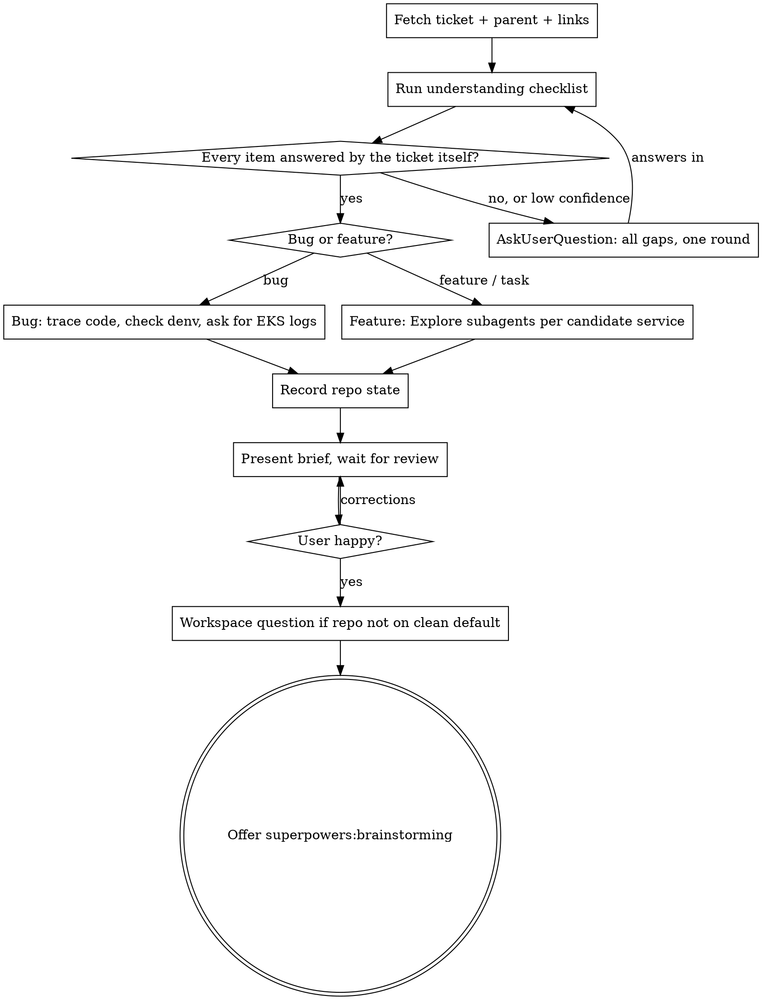

# init-ticket

Turn a Jira ticket into a reviewed understanding of the work before anything is designed or built.

**Core principle: a question to the user is always cheaper than an assumption.** The ticket author knows what they meant. The code only shows what exists. Any gap in what the ticket *means* gets asked, not inferred, no matter how small it looks or how busy the user is.

**Violating the letter of this rule is violating its spirit.** "Small" gaps, "obvious" completions and "reasonable" defaults are all assumptions.

Ticket argument: `$ARGUMENTS`. Accept `HCP-123`, `hcp-123` or a full Jira URL and normalise to the upper-case key. If empty, ask for it and stop.

## Flow



## Step 0: Resolve the environment

1. Run `dm config devenv_path`. The value is `<denv>`. If `dm` is missing, ask the user where denv is checked out.
2. Skim `<denv>/CLAUDE.md` (route-prefix to service map, DB helper scripts) and `<denv>/services.json` (service to repo list); they feed the orientation pass in Step 2 and the research in Step 3. Service code lives at `<denv>/services/<service>/`. Do not duplicate these files' contents into notes; consult them.
3. Load the Jira tools: `ToolSearch` with `select:mcp__claude_ai_Atlassian__getJiraIssue,mcp__claude_ai_Atlassian__searchJiraIssuesUsingJql`. The cloudId is `helmmarkets.atlassian.net`.

## Step 1: Fetch the ticket

Call `getJiraIssue` with `responseContentFormat: markdown` and fields: `summary, description, issuetype, status, priority, labels, components, assignee, reporter, attachment, comment, issuelinks, parent, subtasks, fixVersions, created, updated`.

Then fetch context the ticket depends on:
- `parent` present: fetch it (summary, description, status). Epics often hold the real requirements.
- `issuelinks` present: fetch each linked issue's summary and status. A "blocks" or "duplicates" link changes the work.
- `subtasks` present: list them; they may already split the work.
- Read every comment. Later comments override the description more often than not.

**Attachments and inline media cannot be viewed.** The connector returns metadata only; content URLs need Atlassian auth it does not have, and `blob:` images inside descriptions and comments are unreadable. List every one (filename, type, who added it, where it appears) so they can be asked about in Step 2.

## Step 2: Understanding gate

Answer each item **from the ticket text alone**. Write the answers down before doing anything else.

| Item | Must be answered by |
|------|---------------------|
| Who is the user or persona, and on which screen or route does this happen? | Ticket text |
| Bug: exact steps, expected vs actual, environment (prod, demo, tenant), how often | Ticket text |
| Feature: what changes, for whom, and the complete acceptance criteria | Ticket text |
| Every truncated sentence, dangling reference or product term resolved | Ticket text or user |
| Every scope word defined: "optional", "configurable", "some", "etc", "where appropriate" | Ticket text or user |
| What each attachment, screenshot, recording or inline image shows | User only |
| Any referenced external resource (Slack thread, Confluence page, product feedback board, design file) that is not in the ticket | User only |
| Which decisions the ticket leaves to the implementer that a product owner would want a say in | User |

A short orientation pass is allowed first so the questions are sharp: check the route map, confirm which service owns the area, glance at the obvious component. Deep research is not allowed yet: a handful of greps and file opens to name the component and service, never an end-to-end trace. If that pass cannot confirm that something the ticket refers to actually exists (a screen, a setting, a template, a flag), its existence is a gate question, not a research item.

**If any item is unanswered, answered with low confidence, or answered by inference, call `AskUserQuestion` now.** Put every gap into one round (several questions per call, several calls if needed). For media, offer the user three ways to close the gap: paste the image into the terminal, describe what it shows, or save the file locally and give the path. Wait for answers, then re-run the checklist.

The distinction that matters: questions about **meaning, intent or what a file shows** can only be answered by a person. Questions about **where something lives in the code** are research, not gaps. Never ask the second kind; never research the first kind away.

## Step 3: Research

**Research that contradicts the ticket or one of the user's answers reopens the gate.** If the code shows the referenced screen does not exist, the reported error cannot come from the described path, or an existing mechanism behaves differently from what the ticket assumes, stop and ask again. Do not record the contradiction as a note in the brief and carry on.

### Step 3a: Bug research

1. Map the screen or route to a service with the route map. PHP services route through the `webserver` container; Node services are reached at `<service>:3000`.
2. Trace the code path end to end for the reported behaviour: frontend component, request, gateway route, controller, service, query. Read the key files directly; use read-only `Explore` subagents for wide sweeps so the main context only receives conclusions.
3. Gather local evidence from denv: `docker compose ps` and `docker compose logs --since 1h <service>` run from `<denv>`, and the DB helpers `<denv>/bin/claude_psql` / `claude_mysql` (Postgres tables need schema-qualified names). Exercise the reported path through Envoy only when it needs no data mutation. When a live repro would need new records or state changes, code and DB evidence stand in, and the brief says no live repro was run.
4. If local evidence does not explain the report (prod-only data, tenant config, timing, a specific user), **ask the user for EKS logs**. Give them the service name, the time window and the strings to search for. Do not run `kubectl` against prod or demo yourself.
5. Where more than one fix location is plausible, present all of them with evidence. The choice is the user's, not the brief's.

### Step 3b: Feature research

1. Identify candidate services from the route map and the ticket's domain terms. A route prefix does not imply a separate repo; check `services.json` and the route map's backend target.
2. Dispatch one read-only `Explore` subagent per candidate service, in parallel, each answering: the existing logic for this area, entry points, data model, patterns already used for the same kind of behaviour (notifications, emails, permissions, settings), and where tests live. Keep the raw output in the subagents.
3. Name the precedents worth reusing, with file paths.
4. List the design decisions the ticket leaves open. When the codebase has precedent for more than one pattern, that is a decision for the user, not a recommendation to bake in.

## Step 4: Repo state

This step does not depend on research findings; run it alongside the Step 3 subagents once the affected repos are known. For each affected repo at `<denv>/services/<service>`:

```bash
git -C <path> branch --show-current
git -C <path> symbolic-ref -q --short refs/remotes/origin/HEAD
git -C <path> status --porcelain | wc -l
```

The default branch varies per repo (for example `horizon` defaults to `new-world-demo`, most others to `master`). Never assume `master` or `main`.

## Step 5: The brief

Present in chat, in this order, then stop and wait for the user's review:

1. **Ticket**: key, type, status, priority, parent, one line in your own words.
2. **What is being asked**: bugs get expected vs actual and the confirmed cause, or the candidate causes with evidence; features get the behaviour change and who it serves.
3. **Affected services and key files**: paths, one line each on their role.
4. **How it fits existing logic**: patterns and precedents to reuse.
5. **Decisions still open**: every product or design choice the user must make. Nothing here may be a decision you already made for them.
6. **Risks**: data, permissions, tenants, migrations, performance.
7. **Size**: S, M or L with one sentence of reasoning.
8. **Repo state**: table of service, current branch, default branch, dirty file count.

Close with: "Does this match your understanding of the ticket? Anything to correct before we move on?" Do not proceed until they answer.

## Step 6: After the brief is approved

1. **Workspace.** If any affected repo is not on its clean default branch, ask with `AskUserQuestion`: create an isolated worktree (recommended, via `superpowers:using-git-worktrees`), continue in place, or the user will sort it. In the question, name each repo's current branch, what it appears to belong to (a ticket key in the branch name), and its dirty file count, so the user can decide without looking. If every repo is on a clean default branch, note that work will happen on a new feature branch and move on. Never commit to a default branch.
2. **Handoff.** Offer to continue into `superpowers:brainstorming`. If the work is a single obvious change with no open decisions, say so plainly and still offer. Do not start implementing, do not write a plan, do not open files for editing. The skill ends here.

## Rationalisations that end the skill early

| Thought | Reality |
|---------|---------|
| "The screenshot probably just shows the spinner" | You cannot see it. It may show a different component, an error, or the tenant. Ask. |
| "Presumably a failed network call from devtools" | "Presumably" marks an assumption. Ask where it came from. |
| "Link to the assigned [form], obviously" | A truncated sentence is a gap. Ask what was meant. |
| "This is plumbing, not new infrastructure" | Sizing before the open decisions are resolved. Ask, then size. |
| "Worth resolving before coding" (then carries on) | If it must be resolved before coding, resolve it now by asking. |
| "I'll suggest per-assignment, it matches precedent" | Precedent exists for three patterns. That is the user's product decision. |
| "Not yet verified, quick to check while implementing" | Deferred verification is an accepted assumption. Check now or ask now. |
| "Ready to start implementing" | The skill ends at a reviewed brief. Implementation is never its next step. |
| "They said they're in a hurry" | One wrong assumption costs more than one question round. |
| "The code will tell me what they meant" | Code shows what exists, not what the reporter wants. |
| "I'll note it as an open question in the brief" | If the answer would change what you research, it is a gate question, not a brief note. |

## Red flags: stop and go back to Step 2

- Searching code for the answer to a meaning or intent question.
- Any attachment or inline image absent from both your question round and the brief.
- "Presumably", "likely", "probably", "I assume", "obviously" in your own notes about what the ticket means.
- A brief section titled open questions that would have changed the research.
- The words "fix", "implement" or "plan" before the brief is approved.

## Quick reference

| Need | Use |
|------|-----|
| Ticket fetch | `mcp__claude_ai_Atlassian__getJiraIssue`, cloudId `helmmarkets.atlassian.net`, markdown format |
| Related tickets | `searchJiraIssuesUsingJql` with `parent = HCP-XXX` or `issue in linkedIssues(HCP-XXX)` |
| Denv location | `dm config devenv_path` |
| Route to service, DB helpers | `<denv>/CLAUDE.md` |
| Service repos | `<denv>/services/<service>/`, list in `<denv>/services.json` |
| Local service state | `docker compose ps`, `docker compose logs --since 1h <service>` from `<denv>` |
| Prod or demo logs | Ask the user. Never `kubectl` yourself. |
| Wide code sweeps | `Explore` subagent, read-only, conclusions only |
| Isolated workspace | `superpowers:using-git-worktrees` |
| Next step after approval | `superpowers:brainstorming` |
