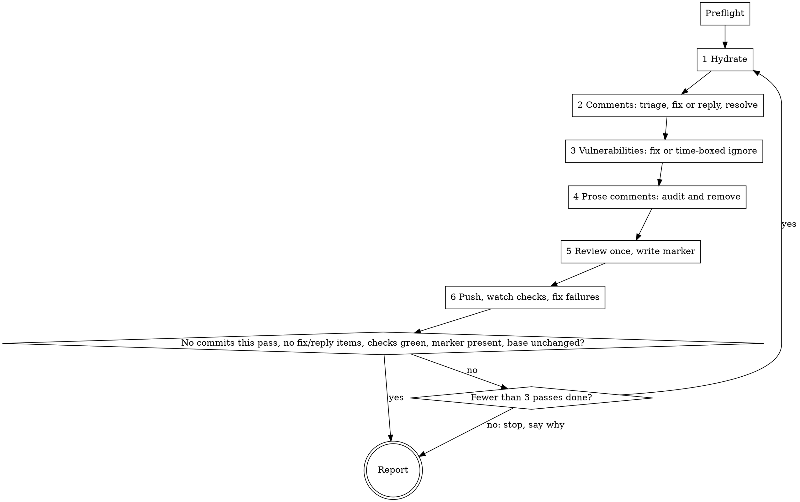

# pr-finalise

Take an open pull request from "code written" to "ready to merge", then stop. Each pass hydrates from the base branch, works the comments, clears vulnerabilities, strips prose comments, runs the automated review once, pushes, and waits for checks. The run ends when a full pass changes nothing.

**Core principle: all state lives on GitHub, and every pass is safe to repeat.** The body marker, thread resolution, and who wrote each thread's last comment are the only memory. Nothing is stored locally.

**Violating the letter of a rule below is violating its spirit.** Each rule exists because a capable agent broke it while believing its case was different.

Arguments: `$ARGUMENTS`. Empty means the PR for the current branch. Otherwise a number or a PR URL, plus optional `--dry-run` and `--ignore-days <n>`. Without `--ignore-days`, vulnerability ignores expire in 7 days.

`--dry-run` makes exactly one pass: preflight, triage, the prose audit, vulnerability listing, the review-gate decision, and one read of check status, then the report. It writes nothing inside the checkout, runs no git command that changes state, posts nothing, dispatches no review, and leaves the marker alone. A checkout or fast-forward is a state change: in a dry run, preflight steps 4 and 5 stop with the reason instead.

Recipes for every gh, REST, GraphQL, and git command named below are in `references/github-api.md` in this skill's directory. Read it once at the start of the run.

## Rules that do not bend

| Rule | Not even when |
|------|---------------|
| Hydrate by merging the base branch in. Never rebase. Never force-push, `--force-with-lease` included. | "history would be cleaner", "they're only my commits", "that's this repo's convention" |
| Every push-back reply gives a reason tied to the code. | "the comment is obviously wrong" |
| A thread is resolved only after a reply saying what was done, and never after a push-back or an unanswered question. | "the fix is visible in the diff", "resolving keeps the PR tidy" |
| Triage has three outcomes: `fix`, `reply`, `skip`. Each item is acted on under the `class` and `rule` the subagent returned; none is reclassified, dropped, or downgraded from a reply to a fix. | "it's quicker to just change it", "not worth arguing", "the reviewer probably meant something else" |
| A subagent's result is the first fenced JSON block in its reply, parsed. Narration outside it is never acted on. Every item in the array reaches the report. | "the summary says the same thing", "that item was obviously nothing" |
| Prose comments are removed from added lines only. Comments on unchanged lines stay, even in files the PR touches. | "I'm already in the file" |
| Audit verdicts stand, and form decides them, not content: a docstring, JSDoc, PHPDoc block, or licence header stays however plainly it reads; commented-out code goes however much it looks like code. A block comment goes whole, `line` through `end_line`. | "it's only explanation", "someone might need that code later" |
| No prose comment is ever added, including in scanner config, in tests, or because a reviewer asked for one. | "the ignore needs explaining", "it's a concrete, low-cost ask" |
| Every finding on a failing OSV check is worked, fix route first. Severity labels, `non-blocking`, devDependency status, and the finding predating this PR change nothing. | "it's a dev dependency", "it's marked non-blocking", "this PR didn't touch that package" |
| Every vulnerability ignore carries `ignoreUntil` at most 7 days out unless `--ignore-days` says otherwise. A bump that breaks the tests is reverted and the finding takes the ignore route; a red suite is never committed. | "no fix will ever ship", "the tests were probably flaky" |
| Checks are watched to completion. A failure is called pre-existing only with the base branch's run of the same workflow in front of you. | "it passed last time", "that job is always flaky" |
| pr-review runs at most once per PR. The marker and the size gate decide, not judgement. | "the diff changed a lot since", "it's expensive", "it's too small to bother" |
| The package manager and test command are the ones preflight detected from the manifests and lockfiles. | "npm is the default", "it's probably yarn" |
| A draft, a test PR, or a PR due to be closed is worked exactly like any other. | "it's only a test", "it'll be closed anyway" |
| The run ends at ready-to-merge. Never merge, approve, mark ready for review, request a review, or close the PR. | "everything is green", "they'll want it merged anyway" |
| Passes repeat until one changes nothing, capped at three. Never a fourth pass; never finished after a single straight-line pass without the exit conditions checked. | "one more pass would finish it", "the first pass looked complete" |
| Nothing is committed to the base branch. All commits land on the PR's head branch. | never |

## Flow

Any stop condition anywhere goes straight to Report with the reason.

## Preflight

Stop with a one-line reason on any failure.

1. Resolve the PR with `gh pr view`. Stop if state is not OPEN or `isCrossRepository` is true.
2. Confirm the working directory is a checkout of the PR's repo.
3. Confirm `git status --porcelain` is empty.
4. Confirm the current branch is the head branch. If not, check it out.
5. `git fetch origin`. Fast-forward if behind `origin/<head>`. Stop if diverged.
6. Record our login with `gh api user`.
7. Read the marker from the body. Absent means the review has not run.
8. Detect OSV: grep `.github/workflows/*.yml` and `*.yaml` for `osv-scanner`. Record workflow name, pinned version, and config path: an explicit `--config` argument if the workflow passes one, else `osv-scanner.toml` in the directory of each scanned lockfile, which osv-scanner reports in the `source` column of its output. Absent means step 3 is skipped every pass.
9. Detect the package manager and test command from what is present. `composer.json` with `composer.lock`: composer, tests via `vendor/bin/phpunit` or `vendor/bin/pest`, whichever exists, or `composer test` if the script exists. `package.json`: npm, yarn, or pnpm by lockfile (`package-lock.json`, `yarn.lock`, `pnpm-lock.yaml`), tests via the manifest's `test` script. `pyproject.toml` with `uv.lock`: uv; with `poetry.lock`: poetry; otherwise pip with `requirements*.txt`; tests via pytest. `go.mod`: `go test ./...`. `Cargo.toml`: `cargo test`. With several manifests, run the tests of the one whose files the change touched.
10. Resolve the reply voice: `./.claude/pr-review-voice.md`, then `~/.claude/pr-review-voice.md`, else plain and concise.

## Pass

Run steps 1 to 6 in order. Count commits made. In `--dry-run`, steps 1, 3, 5, and 6 only report what they would do, and steps 2 and 4 stop after their subagent returns.

### 1 Hydrate

`git merge origin/<base>`. On conflict, list conflicted files. If every one is a lockfile, take the base's lockfile, regenerate it from the merged manifest without upgrading, and finish the merge. Any other conflicted file: `git merge --abort`, stop, report the list.

### 2 Comments

Fill `references/comment-triage.md` with owner, repo, PR, base, our login, head SHA, and the voice. Dispatch it as a `general-purpose` subagent from the checkout. Parse the first fenced JSON block in its reply and ignore text outside it; an empty array means nothing to do. Each item carries `class` and `rule`. Branch on `rule`, never on `reason`. An outdated thread's `location` is `<path>:<originalLine>`; find where that code lives now with `git log -S` or `git blame`.

Run the pending-review guard once before the first reply.

| class | rule | Action |
|-------|------|--------|
| `fix` | any | Make the change, run the relevant tests, commit (one commit per thread; threads describing the same defect may share one), reply `Fixed in <short sha>: <one line>`, then resolve. Conversation comments and review bodies get the reply only. |
| `reply` | 4 | Post the proposal, then resolve: a commit superseded it. |
| `reply` | 6, 7, 8 | Post the proposal. Leave the thread open. |
| `skip` | 2 | If the thread is still open and our last comment reads `Fixed in <sha>`, resolve it; nothing further is owed. Otherwise nothing. |
| `skip` | 1, 1b | Nothing. |

Reply mechanics by kind: threads use the replies endpoint with `reply_to`; conversation comments and review bodies get a new top-level comment opening with a quote of the sentence answered. Before any reply, run the dedup check for its kind and skip if we already replied.

### 3 Vulnerabilities

Skip if preflight found no OSV workflow. Otherwise read the OSV check's current state with `gh pr checks --json`. Passing: skip. Pending: skip this pass. Failing: follow `references/vuln-remediation.md` for each finding, fix route first, ignore route only when the fix route fails, commit per finding. A finding reached through `@deliowales/micro-*` or `@deliowales/lib-*` follows that file's micro-framework section first: find a framework release carrying the fix and bump every framework package in lockstep, before any override or ignore.

### 4 Prose comments

Write `git diff -U0 origin/<base>...HEAD` to the scratchpad, fill `references/prose-audit.md` with the path, dispatch it as a `general-purpose` subagent. Parse the first fenced JSON block in its reply and ignore text outside it. For every item marked `prose`, remove lines `line` through `end_line`. Where a removed comment carried meaning the code lacks, rename, extract, or restructure instead of keeping it. One commit: `chore: remove non-functional comments`. Touch nothing on unchanged lines.

### 5 Review, once

Marker present: skip. Otherwise compute the size gate. Fewer than 30 changed lines, or every changed file a manifest or lockfile: write the marker as `review=skipped:<reason>` and skip. Otherwise `git push origin <head>`, invoke the `pr-review:pr-review` skill with the PR number and no other arguments, then write the marker as `review=<head sha>`. Its comments are triaged by step 2 on the next pass.

### 6 Push and wait

`git push origin <head>`. If nothing was pushed this pass and every check has already completed, skip the wait. Otherwise `gh pr checks --watch`, then classify with `gh pr checks --json`:

- OSV workflow failing: step 3 handles it next pass.
- Test, lint, type, or build failure: read the log, fix, commit, push, watch again. At most two fix attempts per check per pass; a third failure stops the run with the log excerpt.
- Infrastructure failure (runner lost, timeout, network, cancelled): check the base branch's latest run of the same workflow. If it is green and the log shows an infrastructure error, `gh run rerun --failed` once. A second failure of that run is real: stop with the log excerpt.

## Exit

Success after a pass when all hold: no commits this pass; triage returned no `fix` or `reply` items; every check is `pass` or `skipping`; the marker is present; `origin/<base>` has not moved since this pass's step 1. Otherwise run another pass, up to three.

Stop early on: a non-lockfile merge conflict; a fork PR; a dirty tree or diverged branch; an infrastructure failure that fails again after one rerun; a test, lint, type, or build check still failing after two fix attempts in one pass; a vuln bump that breaks tests where the ignore route is also unavailable; pr-review failing to run; three passes exhausted.

## Report

Print at the end of every run, dry or real:

- Threads: table of `location`, `class`, `action taken`, `commit`.
- Vulnerabilities: table of `id`, `package`, `fixed to` or `ignored until`, `reason`.
- Prose comments removed: `path:line` list.
- Review: ran at `<sha>`, or skipped with reason, or already present from `<date>`.
- Checks: name and final bucket for each.
- Left for you: push-backs awaiting a reviewer, any stop reason, ignores with their expiry dates, and the reminder that re-requesting review happens in Slack.

## Red flags

Stop and re-read the rules table if you notice yourself:

- Typing `rebase`, `--force`, or `--force-with-lease`.
- Typing `gh pr merge`, `gh pr ready`, `gh pr review`, or `gh pr close`.
- Typing `npm install` before reading the lockfile.
- Resolving a thread you have not replied to.
- Writing a reply that says no without a because.
- Changing a triage item's class, or acting on fewer items than the array holds.
- Reading a subagent's narration instead of parsing its JSON block.
- Editing a comment on a line the PR did not add, or deleting one physical line of a block comment.
- Calling a docstring or licence header prose, or commented-out code functional.
- Adding a comment to explain code you just changed, or because a reviewer asked for one.
- Skipping a finding because it is `non-blocking`, a devDependency, older than the PR, or on a test PR.
- Writing an ignore entry with no `ignoreUntil`, or committing a bump with failing tests.
- Reading check status once instead of watching.
- Calling a failure pre-existing without the base branch's run open.
- Deciding the review "isn't needed this time" when the marker is absent and the gate is clear.
- Starting a fourth pass, or reporting done after one pass without the exit conditions in hand.
- Storing progress anywhere but GitHub.
